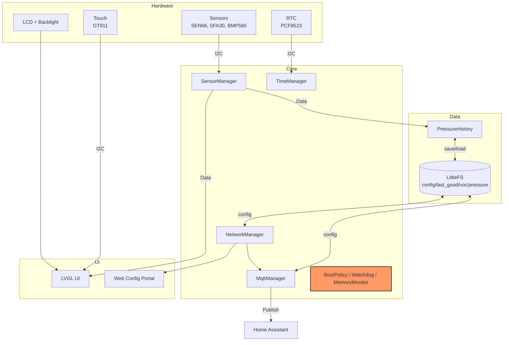

# Project Aura

[](https://platformio.org/)
[](https://www.espressif.com/en/products/socs/esp32-s3)
[](https://lvgl.io/)
[](LICENSE)
[](https://www.youtube.com/watch?v=TNsyDGNrN-w)

Support this project: back the crowdfunding to get detailed build instructions, 3D-printable enclosure models, and wiring guides at:
https://makerworld.com/en/crowdfunding/159-project-aura-make-the-invisible-visible

Project Aura is an open-source ESP32-S3 air-quality station built for makers who want a polished,
reliable device rather than a bare sensor board. It combines a touch-friendly LVGL UI, a local web
setup portal, and MQTT with Home Assistant discovery.

This repository contains the firmware source code and configuration needed to flash and customize the device.

**Join the community:** [GitHub Discussions](https://github.com/21cncstudio/project_aura/discussions)

## Table of Contents
- [Video Demo](#video-demo)
- [Highlights](#highlights)
- [Gallery](#gallery)
- [UI Screens](#ui-screens)
- [Hardware and BOM](#hardware-and-bom)
- [Assembly and Wiring Notice](#assembly-and-wiring-notice)
- [Pin Configuration](#pin-configuration)
- [UI Languages](#ui-languages)
- [Firmware Architecture](#firmware-architecture)
- [Build and Flash](#build-and-flash-platformio)
- [Configuration](#configuration)
- [MQTT + Home Assistant](#mqtt--home-assistant)
- [Contributing](#contributing)
- [AI Assistance](#ai-assistance)
- [License and Commercial Use](#license-and-commercial-use)
- [Tests](#tests)
- [Repo Layout](#repo-layout)

## Video Demo
Click the image.
[](https://www.youtube.com/watch?v=TNsyDGNrN-w)

## Highlights
- Professional telemetry: PM2.5/PM10, CO2, VOC, NOx, temperature, humidity, absolute humidity (AH), pressure, HCHO.
- No soldering required: designed for easy assembly using Grove/QT connectors.
- Smooth LVGL UI with night mode, custom themes, and status indicators.
- Integrated web dashboard at `/dashboard` with live state, charts, events, settings sync, and OTA firmware update.
- Easy setup: Wi-Fi AP onboarding + mDNS portal (http://aura.local) for configuration.
- Home Assistant ready: automatic MQTT discovery and ready-to-use dashboard code.
- Robust Safe Boot: automatic rollback to the last-known-good config after crashes.


## Gallery


## UI Screens
<table>
  <tr>
    <td align="center"><br/>Dashboard</td>
    <td align="center"><br/>Settings</td>
    <td align="center"><br/>Theme Presets</td>
  </tr>
  <tr>
    <td align="center"><br/>MQTT</td>
    <td align="center"><br/>Date &amp; Time</td>
    <td align="center"><br/>Backlight</td>
  </tr>
</table>

## Hardware and BOM
Project Aura is designed around high-quality components to ensure accuracy. If you are sourcing parts yourself,
look for these specific modules:

| Component | Part / Model |
| :--- | :--- |
| Core Board | Waveshare ESP32-S3-Touch-LCD-4.3 (800x480) |
| Main Sensor | Sensirion SEN66 (via Adafruit breakout) |
| Formaldehyde | Sensirion SFA30 (Grove interface, optional) |
| Pressure | Adafruit BMP580 or DPS310 |
| RTC | Adafruit PCF8523 |

Sensor note: the SFA30 is fully supported and widely available. Support for the successor model (SFA40) is on the roadmap.
Note: SEN66 gas indices (VOC/NOx) require about 5 minutes of warmup for reliable readings; the UI shows WARMUP during this period.

Recommended retailers: Mouser, DigiKey, LCSC, Adafruit, Seeed Studio, Waveshare.

## Assembly and Wiring Notice
Please pay close attention to the cabling. The pin order on the board is custom and requires modification
of standard off-the-shelf cables (pin swapping).

Backers: please refer to the comprehensive Build Guide included in your reward for the exact wiring diagram
and a trouble-free assembly.

DIY: verify pinouts against the pin table below before powering on to avoid damaging components.

## Pin Configuration
| Component | Pin (ESP32-S3) | Notes |
| :--- | :--- | :--- |
| 3V3 | 3V3 | Power for external I2C sensors |
| GND | GND | Common ground |
| I2C SDA | GPIO 8 | SEN66, SFA30, BMP580 (external) |
| I2C SCL | GPIO 9 | Shared bus |

Display and touch are integrated on the board; no external wiring is needed for them.

## UI Languages
Project Aura speaks your language. You can switch languages in the Settings menu:
- English
- Deutsch
- Espanol
- Francais
- Italiano
- Portugues BR
- Nederlands
- Simplified Chinese

## Firmware Architecture
Data flow and responsibilities are intentionally split into small managers:



Core modules live in `src/core/` and orchestrate startup (`AppInit`, `BoardInit`).
Feature managers are in `src/modules/`, UI in `src/ui/`, and web pages in `src/web/`.

## Build and Flash (PlatformIO)
Prerequisites: PlatformIO CLI or VSCode + PlatformIO extension.
Built with Arduino ESP32 core 3.1.1 (ESP-IDF 5.3.x).

```powershell
git clone https://github.com/21cncstudio/project_aura.git
cd project_aura
pio run -e project_aura
pio run -e project_aura -t upload
pio run -e project_aura -t uploadfs
pio device monitor -b 115200
```

## Configuration
1. Wi-Fi setup:
   On first boot, the device creates a hotspot: `ProjectAura-Setup`.
   Connect to it and open http://192.168.4.1 to configure Wi-Fi credentials.
2. Web portal:
   Once connected to your network, access the device at http://aura.local/. Configure MQTT, timezone, and themes there.
3. Home Assistant:
   MQTT discovery is enabled by default. The device appears in HA via MQTT integration automatically.
   A ready-to-use dashboard YAML is available at `docs/home_assistant/dashboard.yaml`.
   Setup guide: `docs/home_assistant/README.md`.

Optional compile-time defaults belong in `include/secrets.h`, which is ignored by git.
Copy and edit:

```text
copy include/secrets.h.example include/secrets.h
```

## MQTT + Home Assistant
- State topic: `<base>/state`
- Availability topic: `<base>/status`
- Commands: `<base>/command/*` (night_mode, alert_blink, backlight, restart)
- Home Assistant discovery: `homeassistant/*/config`

MQTT stays idle until configured and enabled.


## Contributing
Contributions are welcome! Please read [`CONTRIBUTING.md`](CONTRIBUTING.md) for details on the process for submitting pull requests and the Contributor License Agreement (CLA).

Found a bug? Open an Issue: https://github.com/21cncstudio/project_aura/issues
Have a question? Ask in Discussions: https://github.com/21cncstudio/project_aura/discussions

## AI Assistance
Parts of this project are developed with AI-assisted workflows.
Primary coding assistance is provided by GPT-5 Codex in a local developer workspace.

## License and Commercial Use
- Firmware in this repository is licensed under GPL-3.0-or-later (see `LICENSE`).
- Commercial use is allowed under GPL. If you distribute firmware (including in devices), you must provide the Corresponding Source under GPL.
- If you need to sell devices while keeping firmware modifications proprietary, obtain a Commercial License (see `COMMERCIAL_LICENSE_SUMMARY.md`).
- Enclosure models and the PDF build guide are not in this repository; they are available to backers on MakerWorld under separate terms.
- Trademark and branding use is covered by `TRADEMARKS.md`.

## Tests
See `TESTING.md` for native host tests and `scripts/run_tests.ps1`.

## Repo Layout
- `src/core/` boot, init, reliability
- `src/modules/` sensors, storage, network, MQTT, time
- `src/ui/` LVGL screens, assets, controllers
- `src/web/` HTML templates and handlers
- `test/` native tests and mocks
